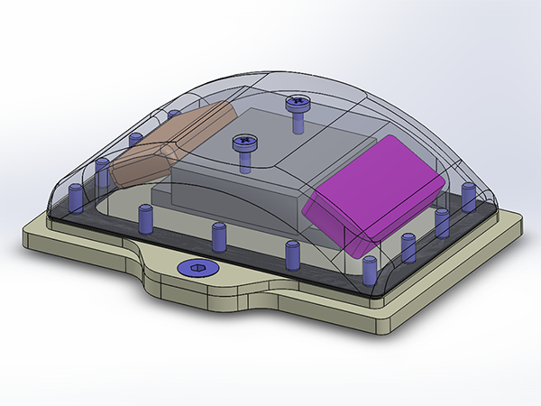

# PitStop1 - Open source turtle tag and turtle camera enclosure
PitStop1 is open source turtle tag enclosure we developed in collaboration with [Zoological Society of London](https://www.zsl.org/). Turtle tags are used to track the movement of turtles and collect the information necessary to design better strategies for their conservation.

In this repository you can find all technical documentation for the latest version of the turtle tag enclosure and the turtle camera enclosure. The documentation for the version 1 of Pitstop1 is available in the branch [version-1](https://github.com/IRNAS/PitStop1/tree/version1).

Read [an article about the open source turtle tags and the development process](https://www.wildlabs.net/resources/case-studies/how-open-source-technologies-could-dramatically-reduce-cost-tagging-green-sea) and get in touch with [us at Institute IRNAS](http://irnas.eu) for customization and orders.

*Photo credit: Alasdair Davies, [@Al2kA](https://twitter.com/Al2kA)*

#### Testing

The enclosure has to sustain in extreme circumstances while mounted on the turtle, such as being hit by rocks, the turtle rubbs its shell at, or hihg pressure at depths up to 200m. To determine what material and sealing to use for the enclosure we did a series of <a href="https://github.com/IRNAS/PitStop1/tree/master/testing">tests</a>.
---

#### License

All our projects are as usefully open-source as possible.

Hardware including documentation is licensed under [CERN OHL v.1.2. license](http://www.ohwr.org/licenses/cern-ohl/v1.2)

Firmware and software originating from the project is licensed under [GNU GENERAL PUBLIC LICENSE v3](http://www.gnu.org/licenses/gpl-3.0.en.html).

Open data generated by our projects is licensed under [CC0](https://creativecommons.org/publicdomain/zero/1.0/legalcode).

All our websites and additional documentation are licensed under [Creative Commons Attribution-ShareAlike 4 .0 Unported License] (https://creativecommons.org/licenses/by-sa/4.0/legalcode).

What this means is that you can use hardware, firmware, software and documentation without paying a royalty and knowing that you'll be able to use your version forever. You are also free to make changes but if you share these changes then you have to do so on the same conditions that you enjoy.

Koruza, GoodEnoughCNC and IRNAS are all names and marks of Institut IRNAS Rače.
You may use these names and terms only to attribute the appropriate entity as required by the Open Licences referred to above. You may not use them in any other way and in particular you may not use them to imply endorsement or authorization of any hardware that you design, make or sell.
